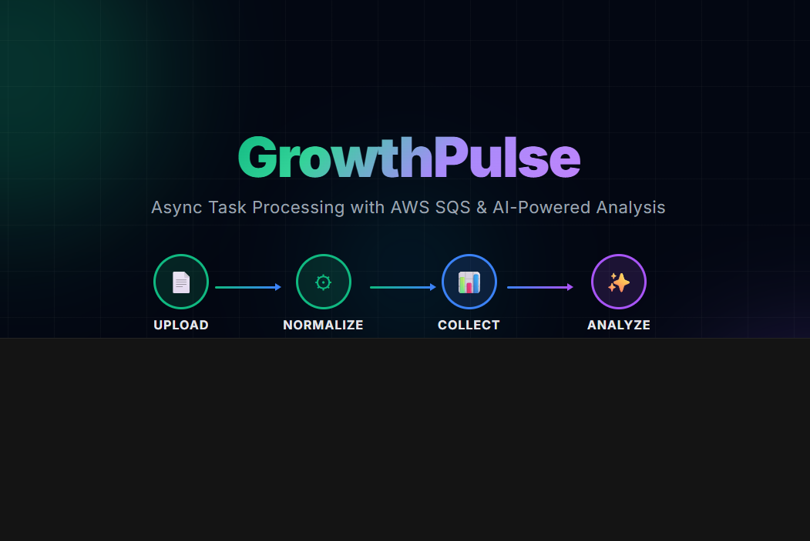

# GrowthPulse — Marketing Intelligence Platform



A full-stack marketing intelligence platform that demonstrates **AWS SQS** for asynchronous task processing combined with **AI-powered analysis** via OpenAI GPT.

## What It Does

A user uploads a CSV spreadsheet with business data. The system dispatches **3 independent tasks** to separate SQS queues, processes them asynchronously, and displays real-time results:

| # | Task | SQS Queue | Description |
|---|------|-----------|-------------|
| 1 | **Normalize** | `growthpulse-normalize` | Cleans, standardizes, and validates raw data |
| 2 | **Collect** | `growthpulse-collect` | Extracts key business metrics (revenue, churn, CAC, LTV) |
| 3 | **Analyze (GPT)** | `growthpulse-analyze` | Generates growth score, risk level, and recommendations via OpenAI GPT |

Each task is decoupled — if one fails, the others continue independently.

## Architecture

```
┌─────────────────┐     ┌─────────────────┐     ┌─────────────────┐
│                  │     │                  │     │                 │
│   Next.js App    │────▶│   FastAPI API    │────▶│   AWS SQS       │
│   (Frontend)     │     │   (Backend)      │     │   (LocalStack)  │
│                  │◀────│                  │◀────│                 │
└─────────────────┘     └─────────────────┘     └─────────────────┘
     :3000                   :8000                   :4566
```

1. Frontend sends CSV to the API
2. API stores data and publishes 3 messages to SQS queues
3. Background worker polls queues, processes each task, stores results
4. Frontend polls status endpoint until all tasks complete, then displays results

## Tech Stack

**Frontend** — Next.js 14 (App Router), TypeScript, Tailwind CSS

**Backend** — Python, FastAPI, boto3, OpenAI SDK

**Infrastructure** — AWS SQS via LocalStack, Docker Compose

**Testing** — 161 tests, 100% code coverage (pytest + Jest)

## Getting Started

### Prerequisites

- Python 3.11+
- Node.js 20+
- Docker (for LocalStack)

### Option 1: Docker Compose (recommended)

```bash
OPENAI_API_KEY=sk-your-key docker compose up --build
```

This starts LocalStack (SQS), Backend, and Frontend together.

### Option 2: Run manually

**Start LocalStack:**
```bash
docker compose up localstack -d
```

**Backend (terminal 1):**
```bash
cd backend
pip install -r requirements.txt
OPENAI_API_KEY=sk-your-key uvicorn app.main:app --reload --port 8000
```

> GPT analysis falls back to rule-based if no API key is provided.

**Frontend (terminal 2):**
```bash
cd frontend
npm install
npm run dev
```

### Access

| Service | URL |
|---------|-----|
| Frontend | http://localhost:3000 |
| Backend API | http://localhost:8000 |
| Swagger Docs | http://localhost:8000/docs |
| LocalStack (SQS) | http://localhost:4566 |

## Sample Data

A sample CSV with 250 rows is included at `data/sample_clients.csv`. To regenerate:

```bash
python scripts/generate_sample.py
```

## Running Tests

**Backend (100% coverage):**
```bash
cd backend
pytest --cov=app --cov-report=term-missing
```

**Frontend (100% coverage):**
```bash
cd frontend
npx jest --coverage
```

## Project Structure

```
├── frontend/          # Next.js 14 + TypeScript + Tailwind
├── backend/           # FastAPI + boto3 + OpenAI
├── docs/              # PRD and Architecture docs
├── data/              # Sample CSV
├── scripts/           # Data generation script
├── localstack-init/   # SQS queue initialization
└── docker-compose.yml
```

## API Endpoints

| Method | Route | Description |
|--------|-------|-------------|
| POST | `/api/upload` | Upload CSV spreadsheet |
| POST | `/api/tasks/process/{upload_id}` | Dispatch all 3 tasks to SQS |
| GET | `/api/tasks/{upload_id}/status` | Task status (polling) |
| GET | `/api/tasks/{upload_id}/results` | Processed results |
| GET | `/api/health` | Health check |

## License

MIT
